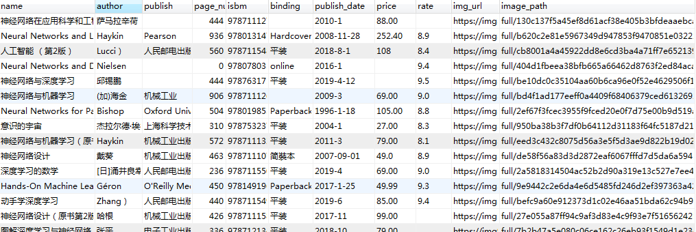
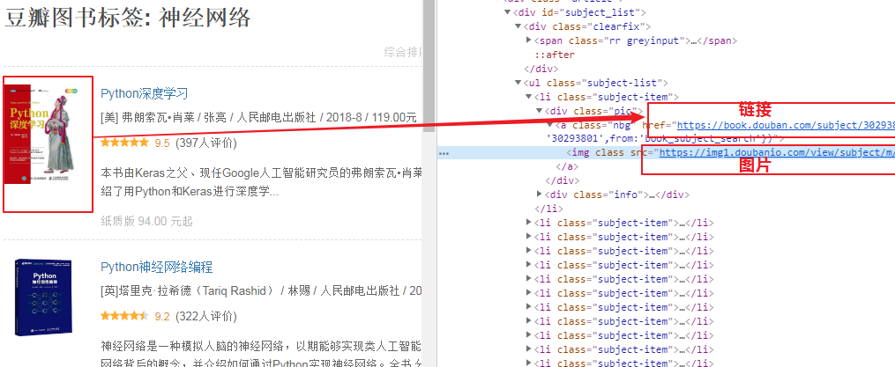

#### 介绍
***
本篇涉及的内容主要是获取分类下的所有图书数据，并写入MySQL

#### 准备
***
Python3.6、Scrapy、Twisted、MySQLdb等

#### 演示
***


#### 代码
***
###### 一、创建项目
```
scrapy startproject BookSpider  #创建项目
scrapy genspider douban book.douban.com #创建豆瓣爬虫
```

###### 二、创建测试类（main.py）
```
from scrapy.cmdline import execute
execute(['scrapy', 'crawl', 'douban'])
```

###### 三、修改配置(spiders/settings.py)
```
USER_AGENT = 'Mozilla/5.0 (Windows NT 6.1; WOW64) AppleWebKit/537.36 (KHTML, like Gecko) Chrome/76.0.3809.100 Safari/537.36' #浏览器
ROBOTSTXT_OBEY = False #不遵循豆瓣网站的爬虫协议
```

###### 四、设置爬取的分类（spiders/douban.py）
```
start_urls = ['https://book.douban.com/tag/神经网络'] # 只测试爬取神经网络
```

###### 五、获取分类列表页图书数据

```
from scrapy.http import Request
from urllib.parse import urljoin

def parse(self, response):
    
    get_nodes = response.xpath('//div[@id="subject_list"]/ul/li/div[@class="pic"]/a')
    for node in get_nodes:
        url = node.xpath("@href").get()
        img_url = node.xpath('img/@src').get()
        yield Request(url=url, meta={"img_url": img_url}, callback=self.parse_book)  # 传递img_url值 放在meta里面， parse_book回调函数，获取的详情再分析
        
    next_url = response.xpath('//div[@class="paginator"]/span[@class="next"]/a/@href').get() # 获取下一页地址
    if(next_url):
        yield Request(url=urljoin(response.url, next_url), callback=self.parse) # 获取下一页内容 
```

###### 六、定义数据模型（spiders/items.py）
```
class BookspiderItem(scrapy.Item):
    # define the fields for your item here like:
    # name = scrapy.Field()
    name = scrapy.Field()
    author = scrapy.Field()
    publish = scrapy.Field()
    page_num = scrapy.Field()
    isbm = scrapy.Field()
    binding = scrapy.Field()
    publish_date = scrapy.Field()
    price = scrapy.Field()
    rate = scrapy.Field()
    img_url = scrapy.Field()
    image_path = scrapy.Field()
```

###### 七、获取图书详情数据

```
import re
from BookSpider.items import BookspiderItem

def parse_book(self, response):
    BookItem = BookspiderItem()
    BookItem['name']     = response.xpath('//span[@property="v:itemreviewed"]/text()').get("").strip()
    BookItem['author']   = response.xpath('//span[contains(text(), "作者")]/following-sibling::a[1]/text()').get("").split()[-1]
    BookItem['publish']  = response.xpath('//span[contains(text(), "出版社")]/following-sibling::text()').get("").strip()
    
    page_num = response.xpath('//span[contains(text(), "页数")]/following-sibling::text()').get("").strip()
    BookItem['page_num'] = 0 if(page_num == '') else page_num

    BookItem['isbm']     = response.xpath('//span[contains(text(), "ISBN")]/following-sibling::text()').get("").strip()
    BookItem['binding']  = response.xpath('//span[contains(text(), "装帧")]/following-sibling::text()').get("").strip()
    BookItem['publish_date'] = response.xpath('//span[contains(text(), "出版年")]/following-sibling::text()').get("").strip()

    price    = response.xpath('//span[contains(text(), "定价")]/following-sibling::text()').get("").strip()
    BookItem['price']    = '' if(len(price) == 0) else re.findall(r'\d+\.?\d*', price)[0]

    BookItem['rate'] = response.xpath('//div[contains(@class, "rating_self ")]/strong/text()').get("").strip()

    BookItem['img_url'] = [response.meta.get('img_url')]  #图片是列表
    
    yield BookItem
```

###### 八、下载图片
1、创建images文件加
2、配置spiders/settings.py
```
ITEM_PIPELINES = {
    'BookSpider.pipelines.ImageStorePipeline': 1,  #后面的数据是优先级
}
IMAGES_URLS_FIELD = "image_url"
IMAGES_STORE = os.path.join(os.path.abspath(os.path.dirname(__file__)), 'images')
```
3、创建ImageStorePipeline类（spiders/pipelines.py）
```
from scrapy.pipelines.images import ImagesPipeline
from scrapy.exceptions import DropItem
from scrapy.http import Request

class ImageStorePipeline(ImagesPipeline):

    default_headers = {
        'accept': 'text/html,application/xhtml+xml,application/xml;q=0.9,image/webp,image/apng,*/*;q=0.8,application/signed-exchange;v=b3',
        'accept-encoding': 'gzip, deflate, br',
        'accept-language': 'zh-CN,zh;q=0.9',
        'user-agent': 'Mozilla/5.0 (Windows NT 6.1; WOW64) AppleWebKit/537.36 (KHTML, like Gecko) Chrome/76.0.3809.100 Safari/537.36', #这个一定要
    }

    def get_media_requests(self, item, info):
        for image_url in item['img_url']:
            self.default_headers['referer'] = image_url
            yield Request(image_url, headers=self.default_headers)

    def item_completed(self, results, item, info):
        image_path = [x['path'] for ok, x in results if ok]
        if not image_path:
            raise DropItem("Item contains no images")
        item['image_path'] = image_path
        return item
```

###### 八、写入数据库
1、配置spiders/settings.py
```
#设置数据库
MYSQL_HOST   = ""
MYSQL_DBNAME = ""
MYSQL_USER   = ""
MYSQL_PASSWORD = ""
ITEM_PIPELINES = {
    'BookSpider.pipelines.ImageStorePipeline': 1,
    'BookSpider.pipelines.MysqlTwistedPipeline': 30,  
}
```
2、创建MysqlTwistedPipeline类（spiders/pipelines.py）
```
import MySQLdb.cursors
from twisted.enterprise import adbapi

class MysqlTwistedPipeline(object):
    def __init__(self, dbpool):
        self.dbpool = dbpool

    @classmethod #静态方法，会优先执行from_settings， 这样self.dbpool就有值了
    def from_settings(cls, settings):

        dbpool = adbapi.ConnectionPool("MySQLdb", host=settings['MYSQL_HOST'], db = settings['MYSQL_DBNAME'], user = settings['MYSQL_USER'], passwd = settings['MYSQL_PASSWORD'], charset = 'utf8', cursorclass = MySQLdb.cursors.DictCursor, use_unicode = True)

        return cls(dbpool)

    def process_item(self, item, spider):
        query = self.dbpool.runInteraction(self.do_insert, item)
        query.addErrback(self.handle_error,item,spider)
    
    def do_insert(self, cursor, item):
        insert_sql = """
            insert into douban(name, author, publish, page_num, isbm, binding, publish_date, price, rate, img_url, image_path)
            values (%s, %s, %s, %s, %s, %s, %s, %s, %s, %s, %s)
        """

        cursor.execute(insert_sql, (item['name'], item['author'], item['publish'], item['page_num'], item['isbm'], item['binding'], item['publish_date'], item['price'], item['rate'], item['img_url'], item['image_path']))

    def handle_error(self, failure, item, spider):
        print(failure)
```

###### 九、测试
1、执行main.py文件
